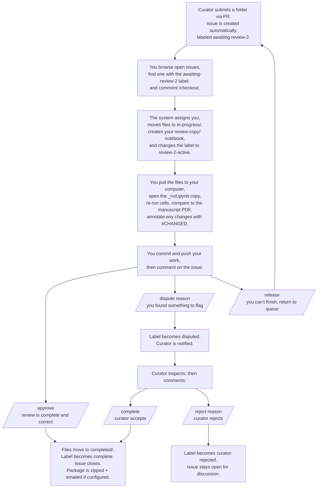

# Reviewer Guide

This guide walks you through doing a second review. If you have not set up your computer yet, start with the [Local Setup Guide](docs/LOCAL_SETUP_GUIDE.md), it covers Git, VS Code, Python, and getting access to the repository.

---

## What the system does

This repository is a shared queue for second reviews of scientific manuscripts and the Jupyter notebooks that reproduce their models. The goal is for every decision during a second review to leave a durable trail, what was checked, what was changed, what was disputed, so the team does not have to ask anyone what happened.

The system handles file movement and notifications for you. You drive it by commenting slash commands like `/checkout` and `/approve` on GitHub issues. There is no separate software to install for the queue itself; everything runs through GitHub.

---

## The full review flow



---

## Step by step

### 1. Find something to review

1. Go to the repository **Issues** tab on GitHub.
2. Filter or scroll for issues with the `awaiting-review-2` label.
3. Click one to open it. The issue body names the paper and where the folder is in the repository.

You cannot second-review your own submission. The system checks this on `/checkout` and `/approve`. If you try, you will get a comment explaining why and your command will not run.

---

### 2. Claim it

In the issue's comment box at the bottom, type `/checkout` and click **Comment**.

The system does this automatically:

- Assigns you to the issue.
- Moves the folder from `reviews/awaiting-review-2/` to `reviews/in-progress/`.
- Creates the review structure inside the folder:
  - `original/` containing the curator's notebook (do not edit).
  - `review-copy/` containing a copy ending in `_rvd.ipynb`, this is your copy.
  - `notes/review_notes.md`, a template for your written notes.
  - `review_metadata.yml`, tracks your username and timestamps.
- Changes the label to `review-2-active`.

Wait a minute for the workflow to finish, the issue page will refresh and you will see a confirmation comment.

---

### 3. Pull the files and open your copy

On your computer, get the latest changes:

**In VS Code:** click the **Source Control** icon in the left sidebar, click the **"..."** menu, click **Pull**.

**In PowerShell:**
```powershell
git pull
```

Then open your `_rvd.ipynb` copy inside `review-copy/`. **Do not open or edit the original notebook in `original/`.**

---

### 4. Do your review

The aim is to verify that the curator's notebook reproduces what the manuscript claims, cell by cell.

- Re-run each cell. The system does not run them for you; you have to do it.
- Compare the results to the manuscript's figures, tables, and stated values.
- For each cell, either agree with the curator's value or change it.

**If you agree, do nothing.** Leave the cell as it is.

**If you change a value, add a `#CHANGED:` comment explaining why.** Put it above the line you changed:

```python
#CHANGED: paper states gamma = 0.1 not 0.14, curator had a typo
gamma = 0.1
```

Or at the end of the line:

```python
final_time = 1200.0   #CHANGED: changed from 1.0 to match the x-axis of figure 1
```

**Optional but strongly encouraged: cite sources with `#SOURCE:`.** This makes the notebook readable later without anyone having to ask where a value came from.

```python
#SOURCE: p.5 eq.(3) - recovery rate
gamma = 0.1
```

Write your `#CHANGED:` reasons clearly. Six months from now, someone reading your work should understand the change without asking anyone.

You also need to fill in `notes/review_notes.md`. At least one of these sections has to have content: **Summary**, **Required Changes**, or **Comments**. The system checks this on `/approve` and rejects if all three are empty.

---

### 5. Save and push your work

You need to commit and push your work before submitting. Otherwise the system sees an empty review.

**In VS Code:**

1. Click the **Source Control** icon in the left sidebar.
2. Review the list of changed files.
3. In the **Message** box, type something short like `Reviewed HBV notebook, two changes`.
4. Click the checkmark to commit.
5. Click **Sync Changes**.

**In PowerShell:**

```powershell
git add .
git commit -m "Reviewed HBV notebook, two changes"
git push
```

If you get an error on push (`Updates were rejected`), pull first (`git pull`) then push again.

---

### 6. Submit your review

Back on the issue page, in the comment box at the bottom, type one of:

- `/approve`, your review is complete and you agree with the curator's notebook (with your noted changes). This is the normal finishing command.
- `/dispute <reason>`, you found something to flag for the curator. Replace `<reason>` with a short clear explanation. Example: `/dispute the source for gamma on p.5 actually says 0.14 not 0.1; reverting my change would also work, but I want the curator to weigh in.`
- `/release`, you cannot finish this review and want to return it to the queue.

For `/approve`:

- The system checks that the folder has the right shape (notebook, review-copy, notes with content, metadata).
- The folder moves to `reviews/completed/`.
- The label changes to `complete` and the issue closes.
- If email is configured, the completed package is zipped and emailed.

For `/dispute`:

- The label changes to `disputed`.
- The curator (the person who originally submitted the paper) is notified by @-mention.
- You are still the assigned reviewer. Wait for the curator's response.

---

### 7. If you used `/dispute`, wait for the curator

The curator will read your reason, look at your changes in `review-copy/`, and respond on the issue with one of:

- `/complete`, they accept your review. The folder moves to `completed/` and the issue closes. You do not need to do anything else.
- `/reject <reason>`, they reject your changes. The label becomes `curator-rejected` and the issue stays open. Read their reason and continue the discussion in comments. There is no automated next step, the two of you negotiate the resolution.

---

## What to do for curators when a review is disputed

If you are the curator and a reviewer used `/dispute` on your paper, you will see an @-mention notification on the issue.

1. Open the issue and read the reviewer's dispute reason.
2. Pull the latest files to your computer.
3. Open the reviewer's `review-copy/` notebook (the file ending in `_rvd.ipynb`) and look at what they changed and why.
4. Decide:
   - **You agree**, comment `/complete` on the issue. The system finalizes it.
   - **You disagree**, comment `/reject <reason>` on the issue with a clear explanation. The label becomes `curator-rejected` and the issue stays open. Discuss next steps with the reviewer in the comments.

---

## Annotation conventions reference

| Annotation | Who writes it | What it means |
|---|---|---|
| `#SOURCE: p.X eq.(Y)` | Curator or reviewer | Where this value came from in the paper. |
| `#CHANGED: reason` | Reviewer | Why this line was changed from the curator's original. |

Both work with or without a space after `#`. Capitalization does not matter. There is no `#DISPUTE:` annotation in the current system, disputes are raised as issue comments via `/dispute`.

---

## Submission folder shape (for curators)

If you are the curator, here is the folder shape you need to submit. Drop a folder under `reviews/awaiting-review-2/` with this content:

```
reviews/awaiting-review-2/MyPaper/
    MyPaper.ipynb       (required, the notebook reproducing the model)
    MyPaper.pdf         (required, the manuscript PDF)
    output1.png         (optional but encouraged, at least one output image)
    metadata.yml        (optional, DOI, etc.; the system will create/edit this)
```

Then commit and push, and open a pull request. The `validate-submission.yml` workflow will check the shape and refuse to merge if a required file is missing. When the PR is merged, the system automatically creates a tracking issue with the `awaiting-review-2` label and adds an entry to `queue/review_log.csv`.

---

## Command reference

| Command | Who | When | What happens |
|---|---|---|---|
| `/checkout` | Any reviewer except Reviewer 1 | Issue is `awaiting-review-2` | Assigns you, moves files to in-progress, creates your review structure. |
| `/release` | The assigned reviewer | Issue is `review-2-active` | Returns files to the queue, unassigns you. |
| `/approve` | The assigned reviewer | Issue is `review-2-active` | Finalizes the review, moves files to completed, closes the issue. |
| `/dispute <reason>` | The assigned reviewer | Issue is `review-2-active` | Flags the item for the curator. Reason is required. |
| `/complete` | The curator (= Reviewer 1) | Issue is `disputed` | Finalizes the disputed review, moves files to completed, closes the issue. |
| `/reject <reason>` | The curator | Issue is `disputed` | Flags the dispute as unresolved. Issue stays open for discussion. Reason is required. |

---

## If something goes wrong

**The workflow failed.** Open the **Actions** tab on GitHub, find the failed run, and read the error. Most failures are about validation (folder shape, empty notes, missing reviewer identity). Post the error as a comment on the issue if you cannot resolve it.

**You edited the wrong notebook.** Comment `/release` on the issue to return the item to the queue. Comment `/checkout` again to re-claim it, your `review-copy/` will be recreated from `original/`.

**You forgot to commit before `/approve`.** The system approves based on whatever is in git at the moment `/approve` runs. If you did not push your changes, they were not part of the approval. Talk to the maintainer about reopening the issue, or open a follow-up PR to add your changes to the completed folder.

**The curator and you cannot agree after a `/reject`.** There is no automated resolution path for this. Talk through it in the issue comments. If you need to start over, ask the maintainer to move the item back to `awaiting-review-2/` and reset the label, this is a manual fix.
