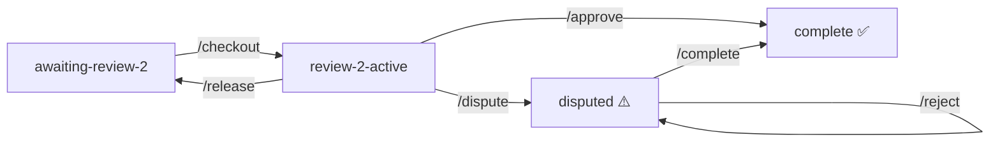

<div align="center">

# 📋 SDE Review Queue

**A GitHub-native system for coordinating second reviews of research manuscripts and Jupyter notebooks.**

No extra software needed — everything runs through issue comments.


</div>

---

## 📌 Overview

The goal is reproducibility and transparency. Every decision made during a review is recorded automatically so nobody has to ask what happened or why.

Each manuscript is tracked as a GitHub issue. Reviewers browse the queue, claim a paper, do their review, and submit — all through issue comments. The system handles the rest.

---

## 🔄 Review Flow



---

## ⚡ What Changed

> Already familiar with the queue? Here is what is different.

| Before | Now |
|---|---|
| `/approve` sent item to `curator-review` | `/approve` goes **straight to completed** — no curator step needed |
| `/dispute` was used by the curator | `/dispute` is now used by **Reviewer 2** when they disagree with something |
| `/complete` could be used after any review | `/complete` is now **curator-only** and only works on disputed items |
| No way for curator to block completion | New `/reject` lets the curator **flag a dispute for further discussion** |
| Checkout created a duplicate loose notebook | Original notebook is now **moved** into `original/` — no duplicate ever exists |

---

## 💬 Slash Commands

| Command | Who | When to use | What happens |
|---|---|---|---|
| `/checkout` | Any reviewer | Item is in `awaiting-review-2` | Moves to `in-progress`, sets up review structure, assigns you |
| `/approve` | Reviewer 2 | Review is complete and correct | Moves straight to `completed/`, closes issue ✅ |
| `/dispute <reason>` | Reviewer 2 | You disagree with something | Flags as disputed, notifies curator ⚠️ |
| `/complete` | Curator only | Item is disputed | Finalizes, moves to `completed/`, closes issue ✅ |
| `/reject <reason>` | Curator only | Curator disagrees with changes | Keeps flagged and open for discussion ❌ |
| `/release` | Reviewer 2 | Want to return without a decision | Moves back to `awaiting-review-2`, unassigns you |

---

## 🟢 Normal Review Flow

```
1. Comment /checkout
   → item moves to reviews/in-progress/
   → review structure is created
   → you are assigned to the issue

2. Open review-copy/ notebook
   → add #SOURCE: p.X where you found each value
   → add #CHANGED: reason above anything you change
   → do not edit anything in original/

3. Comment /approve
   → item moves to reviews/completed/
   → issue closes ✅
```

---

## 🔴 Dispute Flow

```
1. Comment /dispute <your reason>
   → item is flagged as disputed
   → curator is notified ⚠️

2. Curator reviews and either:
   → /complete  moves to completed/, closes issue ✅
   → /reject    keeps flagged, issue stays open for discussion ❌
```

---

## 📓 Notebook Conventions

| Convention | Who | What it means |
|---|---|---|
| `#SOURCE: p.X eq.(Y)` | Curator and reviewer | Where this value came from in the paper |
| `#CHANGED: reason` | Reviewer 2 | Why this line was changed |

---

## 📁 Where Files Live

Each paper moves through three folders:

| Folder | Meaning |
|---|---|
| `reviews/awaiting-review-2/` | Needs a second reviewer |
| `reviews/in-progress/` | Someone is actively reviewing |
| `reviews/completed/` | Review done and finalized |

Each paper folder contains:

| File / Folder | What it is |
|---|---|
| `original/` | Original notebook — moved here on `/checkout`, never edited |
| `review-copy/` | Reviewer's working copy — edit this one |
| `notes/review_notes.md` | Your review notes |
| `review_metadata.yml` | Tracks reviewer, timestamps, and status |

---

## ⚠️ Important: Codespaces-Only Devcontainer

This repository includes a devcontainer intentionally restricted to GitHub Codespaces.

| Environment | Status |
|---|---|
| GitHub Codespaces | ✅ Works normally |
| Local VS Code | ❌ Do not choose "Reopen in Container" |

If you accidentally open it locally, container startup will fail by design.

---

## 🚀 Getting Started

1. **New here?** Start with the [Local Setup Guide](docs/LOCAL_SETUP_GUIDE.md)
2. **Ready to review?** Read the [Reviewer Guide](CONTRIBUTING.md)
3. **Adding a paper?** Drop the folder into `reviews/awaiting-review-2/` and push — an issue is created automatically

---

## 👥 Team Members

Team member names and GitHub usernames are mapped in `team_members.yml`. If your name is not in that file the system cannot notify you or restrict commands correctly — contact the repo maintainer to be added.
