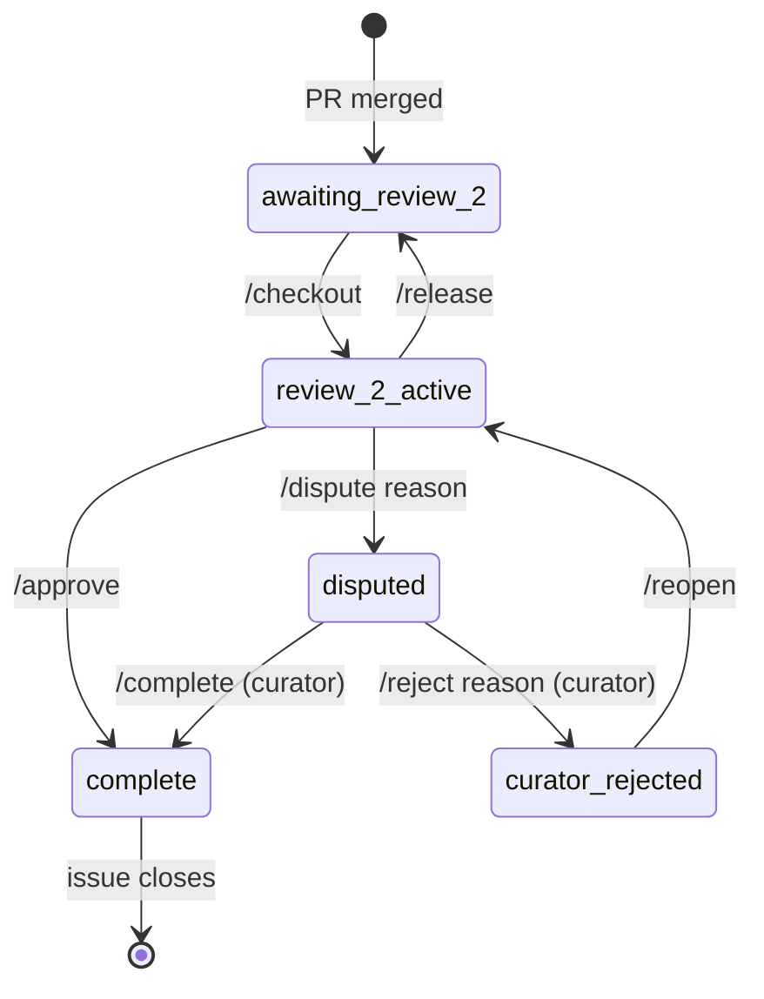

<div align="center">

# SDE Review Queue

**A transparent GitHub-based record of curation, first review, and second review for computational models from academic literature.**

The queue runs entirely on GitHub. You claim and finalize reviews through issue comments on the GitHub website. To do the actual notebook work you still need Git, Python, and an editor on your computer; see the [Local Setup Guide](docs/LOCAL_SETUP_GUIDE.md) if you are new.


</div>

---

## Overview

The goal is a durable trail of every decision so the team does not have to ask anyone what happened. Each label change, slash command, and notebook edit is recorded automatically by GitHub.

The work happens in three stages:

1. **Curation**, a team of 2 selects a paper, implements its model in a Jupyter notebook, and documents the outcome.
2. **First review**, the verifying teammate inside the pair re-runs the notebook and confirms (or pushes back on) the documented outcome.
3. **Second review**, an independent reviewer from outside the team claims the resulting issue, re-runs the work, and either finalizes or escalates a dispute.

Each paper is tracked as a GitHub issue. Reviewers browse the queue, claim items, do the work, and submit through issue comments. The system moves files between folders and updates labels.

---

## Second-Review State Machine

This is the state machine the second-review side runs on. The curator side feeds into `awaiting-review-2` via a pull request.



---

## Slash Commands

| Command | Who | When to use | What happens |
|---|---|---|---|
| `/checkout` | Any reviewer except Reviewer 1 | Item is `awaiting-review-2` | Moves to `in-progress`, sets up review structure, assigns you |
| `/approve` | Assigned Reviewer 2 | Review is complete and correct | Moves to `completed/`, closes the issue |
| `/dispute <reason>` | Assigned Reviewer 2 | You found something to flag for the curator | Label becomes `disputed`, curator is notified |
| `/release` | Assigned Reviewer 2 | You cannot finish the review | Returns to the queue, unassigns you |
| `/complete` | Curator | Item is `disputed` | Finalizes, moves to `completed/`, closes the issue |
| `/reject <reason>` | Curator | Item is `disputed` and the curator disagrees | Label becomes `curator-rejected`, issue stays open for discussion |
| `/reopen` | Assigned reviewer or curator | Item is `curator-rejected` and both parties agree on a path forward | Returns to `review-2-active` so the reviewer can update and retry |

---

## Normal Review Flow

```
1. Comment /checkout
   item moves to reviews/in-progress/
   review structure is created
   you are assigned to the issue

2. Open review-copy/_rvd.ipynb
   add #SOURCE: p.X where you found each value
   add #CHANGED: reason above anything you change
   do not edit anything in original/

3. Commit and push your work

4. Comment /approve
   item moves to reviews/completed/
   issue closes
```

---

## Dispute Flow

```
1. Comment /dispute <reason>
   item is flagged as disputed
   curator is notified

2. Curator inspects, then comments either:
   /complete moves the item to completed/, closes the issue
   /reject keeps the item flagged, issue stays open for discussion

3. After /reject, if the parties agree on a path forward:
   /reopen returns the item to review-2-active
   the reviewer can update the notebook and re-/approve or re-/dispute
```

---

## Notebook Conventions

| Convention | Who | What it means |
|---|---|---|
| `#SOURCE: p.X eq.(Y)` | Curator and reviewer | Where this value came from in the paper |
| `#CHANGED: reason` | Reviewer 2 | Why this line was changed |

---

## Where Files Live

Each paper moves through three folders during second review:

| Folder | Meaning |
|---|---|
| `reviews/awaiting-review-2/` | Needs a second reviewer |
| `reviews/in-progress/` | Someone is actively reviewing |
| `reviews/completed/` | Review done and finalized |

Each paper folder contains:

| File / Folder | What it is |
|---|---|
| `metadata.yml` | DOI and `reviewer_1` (curator's GitHub handle) |
| `original/` | Original notebook, moved here on `/checkout`, never edited |
| `review-copy/` | Reviewer's working copy, edit this one |
| `notes/review_notes.md` | Reviewer's written notes |
| `review_metadata.yml` | Tracks reviewer, timestamps, and status |

Curators draft their work in `curation-dev/` (gitignored) before moving the finished folder into `reviews/awaiting-review-2/` and opening a PR. See the [Codespaces Guide](docs/CODESPACES_GUIDE.md) or the [Local Setup Guide](docs/LOCAL_SETUP_GUIDE.md).

---

## Codespaces and Local Setup

The repository supports two working environments:

- **GitHub Codespaces** (browser-based), see [docs/CODESPACES_GUIDE.md](docs/CODESPACES_GUIDE.md). The `.devcontainer/` configuration files exist but are currently empty placeholders. Until they are populated, a Codespace will not have the `epi-sde` environment pre-installed.
- **Local conda** (your own machine), see [docs/LOCAL_SETUP_GUIDE.md](docs/LOCAL_SETUP_GUIDE.md). Use the install scripts in `curation-dev/setup/`.

The devcontainer is configured for Codespaces only. If you are working in local VS Code, do not pick "Reopen in Container" when prompted.

---

## Adding a Paper

1. Place the finished folder under `reviews/awaiting-review-2/<paper-id>/` with at least `<name>.ipynb` and `<name>.pdf` inside.
2. Commit and push on a feature branch, then open a pull request against `main`.
3. `validate-submission.yml` runs on the PR, checks the folder shape, and records you as `reviewer_1` in `metadata.yml`.
4. After merge, `bootstrap-seed-issues.yml` creates a `[REVIEW]` issue with the `awaiting-review-2` label. The system is ready for an independent second reviewer.

---

## Documentation

### Getting started

- [Local Setup Guide](docs/LOCAL_SETUP_GUIDE.md), install Git, VS Code, and Python on your own machine
- [Codespaces Guide](docs/CODESPACES_GUIDE.md), browser-based development with GitHub Codespaces
- [Workflow Guide](docs/WORKFLOW_GUIDE.md), the git mechanics of pulling, committing, and pushing

### Doing the work

- [Reviewer Guide (CONTRIBUTING.md)](CONTRIBUTING.md), full walkthrough of a second review, including the dispute path
- [Usage Overview](docs/USAGE.md), short summary of how the queue works
- [Process](docs/PROCESS.md), the agreed pipeline from paper selection through second review

### System design

- [Curator side](docs/system-design/curator/), curation and first review
- [Reviewer side](docs/system-design/reviewer/), second review
- [Local-setup side](docs/system-design/local-setup/), the environment for local work
- [Codespaces side](docs/system-design/codespaces/), the environment for browser-based work

### Project meta

- [Roadmap](docs/ROADMAP.md), what is working, in progress, and planned
- [AI and Automation](docs/AI_AND_AUTOMATION.md), the scripted automation in the running system and the AI tooling used during development
- [Merge Plan (deprecated)](docs/MERGE_PLAN.md), historical note pointing to the current process

### Maintainers

- [Setup](docs/SETUP.md), one-time setup of labels, email secrets, and organization transfer
- [Email Setup](docs/EMAIL_SETUP.md), step-by-step SMTP configuration for the notification workflows (Gmail, Outlook, SendGrid, Mailgun, generic)
- [Workflows](docs/WORKFLOWS.md), reference for every GitHub Actions workflow: triggers, inputs, outputs, secrets, permissions, and flow diagrams

---

## Team Members

Team member names and GitHub usernames are in [team_members.yml](team_members.yml). If your name is not there, the system cannot notify you or recognize you in notebook content; contact the repo maintainer to be added.
