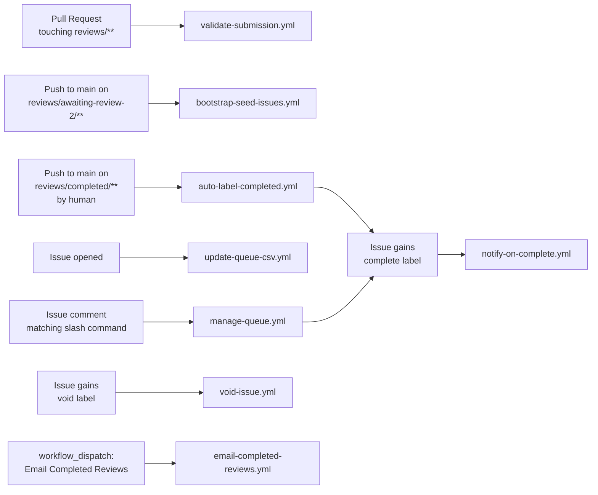
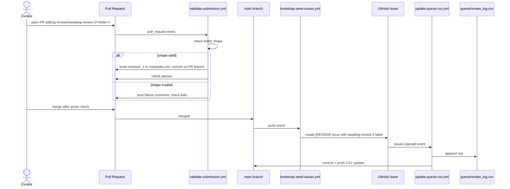
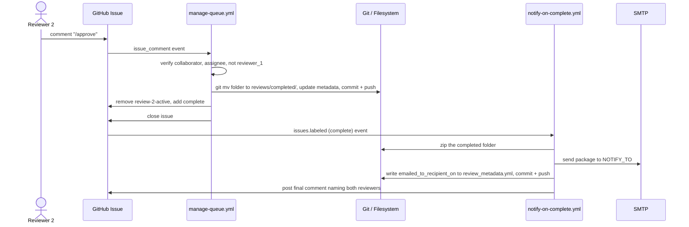
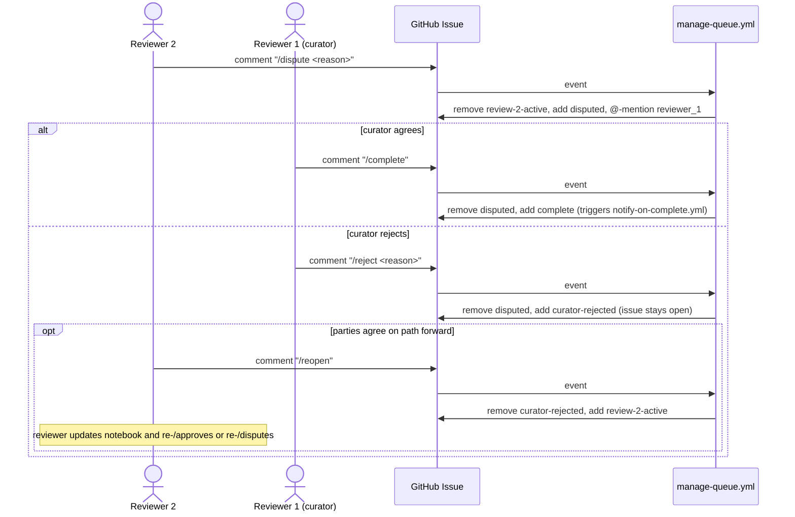
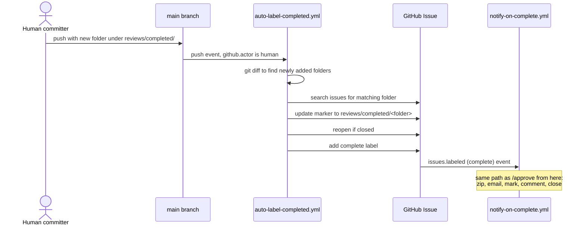
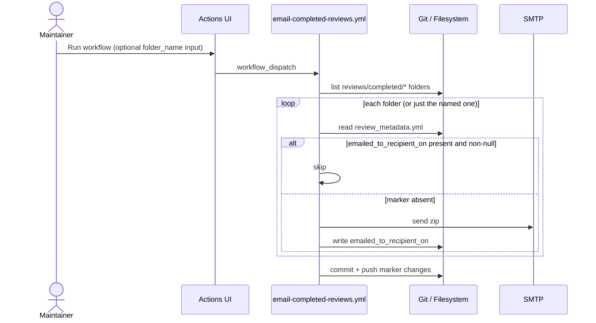

# Workflows

Reference for every GitHub Actions workflow in this repository. Each section names the trigger, the inputs read, the outputs written, the required secrets and permissions, and the verification signal.

---

## Workflow list

| File | Trigger | Purpose |
|---|---|---|
| `bootstrap-seed-issues.yml` | Push to main on `reviews/awaiting-review-2/**`, or workflow_dispatch | Creates a `[REVIEW]` issue for each folder in `reviews/awaiting-review-2/` that does not already have one |
| `validate-submission.yml` | pull_request on `reviews/**` | Checks the folder shape and writes `reviewer_1` into `metadata.yml` |
| `update-queue-csv.yml` | issues.opened | Appends a row to `queue/review_log.csv` |
| `manage-queue.yml` | issue_comment matching a slash command | Dispatches `/checkout`, `/release`, `/approve`, `/dispute`, `/complete`, `/reject`, `/reopen` |
| `notify-on-complete.yml` | issues.labeled with `complete` | Moves the folder to `reviews/completed/`, zips, emails, writes `emailed_to_recipient_on`, posts a summary comment, closes the issue |
| `auto-label-completed.yml` | Push to main on `reviews/completed/**` by a non-bot actor | Finds the matching issue and applies the `complete` label so `notify-on-complete.yml` handles the rest |
| `email-completed-reviews.yml` | workflow_dispatch (with optional `folder_name` input) | Backfill: emails any completed folder without the `emailed_to_recipient_on` marker |
| `void-issue.yml` | issues.labeled with `void` | Closes the issue without moving files or sending notifications |

---

## Trigger map



---

## bootstrap-seed-issues.yml

**File:** `.github/workflows/bootstrap-seed-issues.yml`

**Triggers:**
- `push` to `main` with path filter `reviews/awaiting-review-2/**`
- `workflow_dispatch` (manual)

**Reads:**
- Folders under `reviews/awaiting-review-2/`
- Each folder's `metadata.yml` for `doi` and `reviewer_1`
- The repository's open issues, to avoid creating duplicates

**Writes:**
- A new GitHub issue per folder that does not already have a tracking issue. Title: `[REVIEW] <folder-name>`. Body includes an HTML marker `<!-- folder: reviews/awaiting-review-2/<folder> -->`. Labels: `awaiting-review-2`.

**Required secrets:** none

**Required permissions:** `issues: write`, `contents: read`

**Verification:** A new issue appears under the Issues tab with the `awaiting-review-2` label and the folder marker in its body.

---

## validate-submission.yml

**File:** `.github/workflows/validate-submission.yml`

**Triggers:**
- `pull_request` with path filter `reviews/**`

**Reads:**
- The PR diff, to identify which folders were touched
- Each touched folder's contents

**Writes (same-repo PRs only):**
- `metadata.yml.reviewer_1` set to the PR author's GitHub handle
- A commit on the PR branch with that change

**Posts on the PR:**
- A failure comment if the folder shape is invalid (missing `.ipynb` or `.pdf`)
- A warning comment if no output image is present (does not block merge)

**Required secrets:** none

**Required permissions:** `contents: write`, `pull-requests: write`

**Verification:** PR check status is green; `metadata.yml.reviewer_1` is set on merge.

---

## update-queue-csv.yml

**File:** `.github/workflows/update-queue-csv.yml`

**Triggers:**
- `issues.opened`

**Reads:**
- The opened issue's title and body, to extract `name` and `doi`
- The current `queue/review_log.csv` (to skip duplicates by issue number)

**Writes:**
- One new row in `queue/review_log.csv` with columns: `name,doi_or_url,added_by,added_on,issue_number`
- A bot commit on `main` with the CSV update

**Required secrets:** none

**Required permissions:** `contents: write`, `issues: read`

**Concurrency:** Serialized via `concurrency: update-queue-csv` so concurrent issue-creates do not race on the CSV.

**Verification:** A new row appears at the end of `queue/review_log.csv`.

---

## manage-queue.yml

**File:** `.github/workflows/manage-queue.yml`

**Triggers:**
- `issue_comment` whose body begins with `/checkout`, `/release`, `/approve`, `/dispute`, `/complete`, `/reject`, or `/reopen`
- Only on open issues

**Reads per command:**
- The commenter's identity
- The issue body for the folder marker
- The folder's `metadata.yml` for `reviewer_1` (used for the integrity check)
- The issue's current label set

**Writes per command:**

| Command | Folder move | Label change | metadata.yml | review_metadata.yml | Comment | Other |
|---|---|---|---|---|---|---|
| `/checkout` | `awaiting-review-2/` → `in-progress/` | remove `awaiting-review-2`, add `review-2-active` | (none) | create with `reviewer`, `checkout_timestamp`, `original_notebook`, `review_copy_notebook`, `status: in-progress` | confirmation with @-mention | assignee added |
| `/release` | `in-progress/` → `awaiting-review-2/` | remove `review-2-active`, add `awaiting-review-2` | (none) | (none) | confirmation | assignee removed |
| `/approve` | `in-progress/` → `completed/` | remove `review-2-active`, add `complete` | set `reviewer_2`, `state: complete`, `reviewer_2_completed` | set `approval_timestamp`, `approved_by`, `status: completed` | confirmation | issue closes |
| `/dispute <reason>` | (no move) | remove `review-2-active`, add `disputed` | (none) | (none) | reason + @-mention to `reviewer_1` | (none) |
| `/complete` | `in-progress/` → `completed/` | remove `disputed`, add `complete` | (same as `/approve`) | (same as `/approve`) | confirmation | issue closes |
| `/reject <reason>` | (no move) | remove `disputed`, add `curator-rejected` | (none) | (none) | reason | issue stays open |
| `/reopen` | (no move) | remove `curator-rejected`, add `review-2-active` | (none) | (none) | confirmation | (none) |

**Integrity checks:**
- All commands: commenter must be a collaborator. Non-collaborators get a refusal comment.
- `/checkout`, `/release`, `/approve`: commenter must not equal `reviewer_1`. The commenter must be the issue's assignee for `/release` and `/approve`.
- `/dispute`: requires a non-empty reason after the command.
- `/complete`, `/reject`: only valid when the label is `disputed`, only the curator (`reviewer_1`) can run.
- `/reject`: requires a non-empty reason after the command.
- `/reopen`: only valid when the label is `curator-rejected`, only the assigned reviewer or the curator can run.

**Required secrets:** none

**Required permissions:** `contents: write`, `issues: write`, `pull-requests: write`

**Verification:** The issue's label changes and the commit history shows the bot commit moving the folder.

---

## notify-on-complete.yml

**File:** `.github/workflows/notify-on-complete.yml`

**Triggers:**
- `issues.labeled` when `github.event.label.name == 'complete'`

**Reads:**
- The issue body for the folder marker (`<!-- folder: ... -->` or `<!-- path: ... -->`)
- The folder's `metadata.yml` for `reviewer_1` and `reviewer_2`
- The folder's existence on disk

**Writes:**
- Moves the folder to `reviews/completed/` if it is not already there
- Updates `metadata.yml.reviewer_2` and `metadata.yml.state` to `complete`
- Adds `metadata.yml.reviewer_2_completed: <YYYY-MM-DD>`
- Updates the issue body marker to point at the completed path
- Adds `review_metadata.yml.emailed_to_recipient_on: <YYYY-MM-DD>` after the email succeeds
- Commits and pushes both the metadata changes and the marker

**Email:**
- Subject: `[SDE Review Complete] <folder>`
- To: `NOTIFY_TO`
- Cc: `FROM_EMAIL`
- Body: short summary with the issue URL and the folder path
- Attachment: zip of the completed folder

**Posts on the issue:**
- A final comment naming both reviewers and the completed path
- Closes the issue

**Required secrets:** `SMTP_SERVER`, `SMTP_PORT`, `SMTP_LOGIN`, `SMTP_KEY`, `FROM_EMAIL`, `NOTIFY_TO`

**Required permissions:** `contents: write`, `issues: write`

**Failure modes:**
- Folder not found at the marker path: the workflow fails. Fix the marker or move the folder, then re-apply the label.
- SMTP authentication fails: email step fails, `emailed_to_recipient_on` is not written, issue is not closed. Fix secrets and re-apply the label, or trigger `email-completed-reviews.yml` after the fact.

**Verification:**
- The issue closes
- A commit titled `Finalize review: <folder> (closes #N)` appears on main
- A commit titled `Mark <folder>: emailed_to_recipient_on=<date>` appears on main
- The recipient receives the email
- The folder's `review_metadata.yml` contains `emailed_to_recipient_on: <date>`

---

## auto-label-completed.yml

**File:** `.github/workflows/auto-label-completed.yml`

**Triggers:**
- `push` to `main` with path filter `reviews/completed/**`
- Job guarded by `if: github.actor != 'github-actions[bot]'` (skips bot pushes)

**Reads:**
- The git diff of the push, to find folders newly added under `reviews/completed/`
- The repository's issues (all states), to find the issue whose body marker or title matches each new folder

**Writes (per matched issue):**
- Updates the issue body marker to `reviews/completed/<folder>`
- Reopens the issue if it was closed
- Adds the `complete` label

**Required secrets:** none

**Required permissions:** `contents: read`, `issues: write`

**Failure modes:**
- No matching issue found: a warning is logged and the folder is left alone. Use `email-completed-reviews.yml` to backfill.
- Folder name does not appear in any issue title or body: same as above.

**Verification:**
- The matched issue gains the `complete` label
- `notify-on-complete.yml` fires on that label change and handles the rest

---

## email-completed-reviews.yml

**File:** `.github/workflows/email-completed-reviews.yml`

**Triggers:**
- `workflow_dispatch` (manual)
- Optional input: `folder_name` — if set, only that folder is processed; if empty, all unsent folders are processed

**Reads:**
- Folders under `reviews/completed/`
- Each folder's `review_metadata.yml` for the `emailed_to_recipient_on` key

**Skip logic:**
- A folder with `emailed_to_recipient_on:` present and non-null in `review_metadata.yml` is skipped
- A folder without `review_metadata.yml` is treated as unsent

**Writes (per unsent folder):**
- Zips the folder
- Sends the zip via SMTP to `NOTIFY_TO`
- Writes `emailed_to_recipient_on: <YYYY-MM-DD>` into the folder's `review_metadata.yml` (creates the file if needed)
- Commits and pushes the marker changes

**Required secrets:** `SMTP_SERVER`, `SMTP_PORT`, `SMTP_LOGIN`, `SMTP_KEY`, `FROM_EMAIL`, `NOTIFY_TO`

**Required permissions:** `contents: write`

**Concurrency:** Serialized via `concurrency: email-completed-reviews`

**Verification:**
- The Actions log shows `+ Sent: <folder>` or `- Skipped (already emailed): <folder>` for each
- A commit titled `Mark completed folders as emailed_to_recipient` appears if any new markers were written
- The recipient receives one email per unsent folder

---

## void-issue.yml

**File:** `.github/workflows/void-issue.yml`

**Triggers:**
- `issues.labeled` when `github.event.label.name == 'void'`

**Writes:**
- Closes the issue with state reason `not_planned`
- Posts a short comment noting the issue was voided

**Required secrets:** none

**Required permissions:** `issues: write`

**Verification:** The issue closes as `not planned` with the void comment.

---

## Labels

| Label | Set by | Means | Triggers a workflow |
|---|---|---|---|
| `awaiting-review-2` | `bootstrap-seed-issues.yml`, `manage-queue.yml` (on `/release`) | Folder is in `reviews/awaiting-review-2/`, no claim | (no follow-on workflow) |
| `review-2-active` | `manage-queue.yml` (on `/checkout`, `/reopen`) | Folder is in `reviews/in-progress/`, a reviewer is assigned | (no follow-on workflow) |
| `complete` | `manage-queue.yml` (on `/approve`, `/complete`), `auto-label-completed.yml` | Folder is in `reviews/completed/`, review finalized | `notify-on-complete.yml` |
| `disputed` | `manage-queue.yml` (on `/dispute`) | Reviewer 2 flagged the work; awaiting curator | (no follow-on workflow) |
| `curator-rejected` | `manage-queue.yml` (on `/reject`) | Curator rejected the disputed review | (no follow-on workflow) |
| `void` | Applied manually by a maintainer | Issue should be closed without finalization | `void-issue.yml` |

---

## Metadata files

### `<folder>/metadata.yml` (curator-side)

Created by the curator at submission; modified by `validate-submission.yml` and `notify-on-complete.yml`.

| Field | Written by | Meaning |
|---|---|---|
| `name` | curator | Short identifier for the paper |
| `doi` | curator | DOI of the manuscript |
| `url` | curator | Optional URL (used when DOI is missing) |
| `notebook` | curator | Notebook filename |
| `manuscript` | curator | Manuscript PDF filename |
| `output_image` | curator | Output image filename or `null` |
| `reviewer_1` | `validate-submission.yml` on PR merge | PR author's GitHub handle |
| `reviewer_1_completed` | curator | Date the curator finished implementing |
| `reviewer_2` | `notify-on-complete.yml` | Assigned reviewer's GitHub handle |
| `state` | `notify-on-complete.yml` | Set to `complete` when finalized |
| `reviewer_2_completed` | `notify-on-complete.yml` | Date the review was finalized |

### `<folder>/review_metadata.yml` (reviewer-side)

Created by `manage-queue.yml` on `/checkout`; modified by `manage-queue.yml`, `notify-on-complete.yml`, `email-completed-reviews.yml`.

| Field | Written by | Meaning |
|---|---|---|
| `paper_id` | `manage-queue.yml` on `/checkout` | Folder name |
| `status` | `manage-queue.yml` on `/checkout`, `/approve`, `/complete` | `in-progress`, `completed` |
| `reviewer` | `manage-queue.yml` on `/checkout` | Reviewer 2's GitHub handle |
| `checkout_timestamp` | `manage-queue.yml` on `/checkout` | ISO timestamp |
| `original_notebook` | `manage-queue.yml` on `/checkout` | Original notebook filename |
| `review_copy_notebook` | `manage-queue.yml` on `/checkout` | `<name>_rvd.ipynb` |
| `approval_timestamp` | `manage-queue.yml` on `/approve`, `/complete` | ISO timestamp |
| `approved_by` | `manage-queue.yml` on `/approve`, `/complete` | Whoever finalized (Reviewer 2 or curator) |
| `emailed_to_recipient_on` | `notify-on-complete.yml`, `email-completed-reviews.yml` | Date the package was emailed (`YYYY-MM-DD`) |

### `queue/review_log.csv`

Written by `update-queue-csv.yml`.

Columns: `name,doi_or_url,added_by,added_on,issue_number`

One row per opened issue. Duplicates by issue number are skipped.

---

## Issue body marker

`bootstrap-seed-issues.yml` writes an HTML comment into the issue body to track the folder location:

```
<!-- folder: reviews/awaiting-review-2/<folder> -->
```

This marker is updated to `reviews/completed/<folder>` by `notify-on-complete.yml` and by `auto-label-completed.yml`.

Older issues may use `<!-- path: ... -->` instead. Both forms are recognized by `notify-on-complete.yml`.

---

## Required secrets

Set under Settings → Secrets and variables → Actions:

| Secret | Used by | Purpose |
|---|---|---|
| `NOTIFY_TO` | `notify-on-complete.yml`, `email-completed-reviews.yml` | Recipient address |
| `SMTP_SERVER` | both | SMTP host |
| `SMTP_PORT` | both | SMTP port (usually `587`) |
| `SMTP_LOGIN` | both | SMTP username |
| `SMTP_KEY` | both | SMTP password or app key |
| `FROM_EMAIL` | both | "From" address |

If any are missing, the email step fails. The folder moves and the label changes still happen; the `emailed_to_recipient_on` marker is not written until a successful send completes.

---

## Flows

### Submission (curator opens PR)



### Happy path (/approve)



### Dispute and reopen



### Hand-commit catch



### Manual backfill



---

## Manual fallback (no Actions runner)

When Actions cannot run (no runner available, secrets unset, network blocked), a local Python script sends a single completed folder from a human's machine.

**Script:** `scripts/email_completed_review.py`

**Usage:**

```bash
# Set the SMTP env vars (same names as the workflow secrets)
export SMTP_SERVER=smtp.example.com
export SMTP_PORT=587
export SMTP_LOGIN=your-login
export SMTP_KEY='your-app-password'
export FROM_EMAIL=from@example.com
export NOTIFY_TO=to@example.com

# Send one folder
python3 scripts/email_completed_review.py 'reviews/completed/HBV'
```

The script:
- Zips the folder
- Sends the zip via SMTP
- Writes `emailed_to_recipient_on: <today>` into the folder's `review_metadata.yml` (creates the file if needed)
- Prints what it did

After running, commit and push the marker change so future workflow runs do not re-send the same folder.

---

## Concurrency summary

| Workflow | Concurrency group | Cancel in progress |
|---|---|---|
| `update-queue-csv.yml` | `update-queue-csv` | no |
| `auto-label-completed.yml` | `auto-label-completed` | no |
| `email-completed-reviews.yml` | `email-completed-reviews` | no |
| All others | (none) | n/a |

Serialization protects the CSV append and the marker commits from racing concurrent runs.
