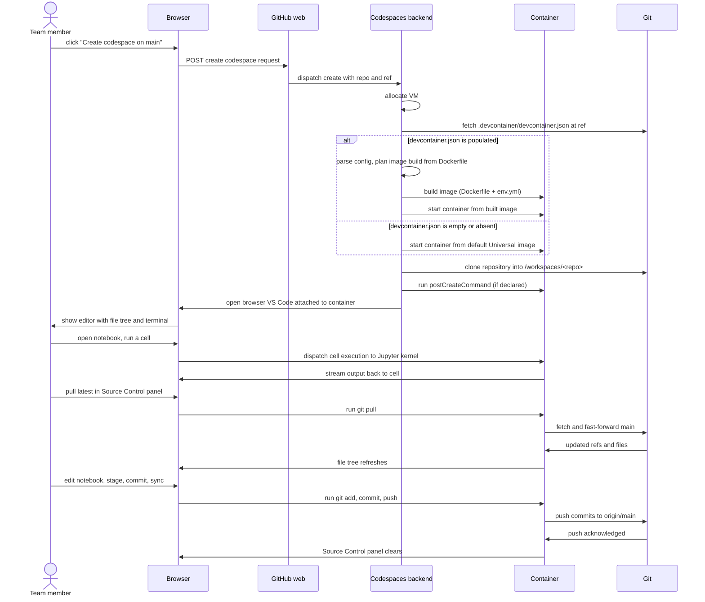

# Methodology

## What the steps are

The team member's procedure has nine steps in order. Three of them are one-time setup (login, repo navigation, opening the Code dropdown). One is the create action. The remaining steps are the wait, the work in the environment, the save and sync, and the close-and-reopen cycle.

### Codespaces team-member hierarchical task analysis

```mermaid
flowchart TD
    G[Goal: open a working browser-based<br/>environment with epi-sde available<br/>and the repository checked out]
    G --> T1[Task 1<br/>Log into GitHub]
    G --> T2[Task 2<br/>Navigate to the repo]
    G --> T3[Task 3<br/>Open the Code dropdown]
    G --> T4[Task 4<br/>Switch to the Codespaces tab]
    G --> T5[Task 5<br/>Create codespace on main]
    G --> T6[Task 6<br/>Wait for the build]
    G --> T7[Task 7<br/>Use browser-based VS Code]
    G --> T8[Task 8<br/>Save and sync work]
    G --> T9[Task 9<br/>Close or reopen later]

    T1 --> T1a[1a. Open github.com in browser]
    T1 --> T1b[1b. Sign in with credentials]
    T1 --> T1c[1c. Confirm collaborator access<br/>to file_queuing_system]

    T2 --> T2a[2a. Open repository URL]
    T2 --> T2b[2b. Confirm landing on main branch]

    T3 --> T3a[3a. Click green Code button]
    T3 --> T3b[3b. Panel opens with Local / Codespaces tabs]

    T4 --> T4a[4a. Click Codespaces tab]
    T4 --> T4b[4b. See list of existing codespaces (if any)]

    T5 --> T5a[5a. Click Create codespace on main]
    T5 --> T5b[5b. New browser tab opens with build screen]

    T6 --> T6a[6a. Codespaces backend reads<br/>.devcontainer/devcontainer.json]
    T6 --> T6b[6b. Image build runs (first time only)]
    T6 --> T6c[6c. Repository auto-clones into /workspaces]
    T6 --> T6d[6d. postCreateCommand runs<br/>(activates epi-sde when config is populated)]

    T7 --> T7a[7a. VS Code opens in browser]
    T7 --> T7b[7b. File explorer shows repo files]
    T7 --> T7c[7c. Terminal panel available]
    T7 --> T7d[7d. Edit notebooks and source files]

    T8 --> T8a[8a. Source Control panel shows changes]
    T8 --> T8b[8b. Stage, commit with message]
    T8 --> T8c[8c. Sync Changes pushes to GitHub]

    T9 --> T9a[9a. Close browser tab; Codespace persists]
    T9 --> T9b[9b. Return via Code dropdown ->Codespaces tab]
    T9 --> T9c[9c. Click existing codespace to reopen]
```

### Task 1 through Task 4: Setup and navigation

The team member opens GitHub in a browser, signs in, navigates to the repository, opens the Code dropdown, and switches to the Codespaces tab. These steps are platform-standard and produce no automation visible to the user beyond the panel rendering.

**Steps in detail:**

| Step | What happens | What you see | How you know it's done |
|---|---|---|---|
| Open browser, navigate to github.com | Browser HTTP request | GitHub login page renders | Login page visible |
| Sign in | Credentials posted to GitHub | Session cookie set; profile loads | Signed-in landing page |
| Navigate to repo | Browser navigates to repository URL | Repo page renders with branch indicator on main | Repo page visible |
| Click Code dropdown | Browser dispatches click event | Panel opens with Local and Codespaces tabs | Panel visible |
| Click Codespaces tab | UI swaps tab content | List of existing Codespaces (if any) renders, plus Create button | Codespaces tab active |

### Task 5: Create codespace on main

The team member clicks Create codespace on main. The browser posts a Codespace-creation request to GitHub. GitHub responds by opening a new browser tab pointed at the building Codespace and dispatches the build request to the Codespaces backend.

**Steps in detail:**

| Step | What happens | What you see | How you know it's done |
|---|---|---|---|
| Click Create codespace on main | Browser posts create request to GitHub web | GitHub web acknowledges and redirects to the codespace URL | New tab opens with build screen |
| GitHub web dispatches to Codespaces backend | Backend receives create request with repo and ref | Backend allocates a VM, prepares to clone the repo | "Setting up your codespace" message visible |

### Task 6: Wait for the build

The Codespaces backend allocates a VM, fetches `.devcontainer/devcontainer.json` from the repository at the requested ref, builds the image (using the Dockerfile if referenced), starts the container, clones the repository into `/workspaces/<repo>` inside the container, and runs `postCreateCommand` and `postStartCommand` if declared. First builds take a few minutes; reopens of the same Codespace skip the build.

**Steps in detail:**

| Step | What happens | What you see | How you know it's done |
|---|---|---|---|
| Backend reads `.devcontainer/devcontainer.json` | Backend fetches the file at the requested ref | If file is populated, build proceeds with declared config; if file is empty, backend falls back to default Universal image | Build plan selected |
| Image build runs | Dockerfile layers built; features installed; conda env built from `env.yml` (when populated) | Build log streams to the browser tab | Build completes |
| Repository auto-clones | Codespaces clones the repo into `/workspaces/<repo>` | File tree appears in VS Code sidebar | Repository files visible |
| `postCreateCommand` runs | Declared command executes inside the container (for example, activate `epi-sde`) | Output appears in the Codespaces terminal panel | Terminal prompt ready |
| Browser VS Code attaches | Codespaces backend connects the browser VS Code client to the container | VS Code UI renders with file explorer, editor, terminal | Editor ready |

### Task 7: Use the browser-based VS Code

The team member edits notebook files and source files inside the browser VS Code. The Jupyter kernel runs inside the container against the `epi-sde` environment (when the configuration is populated to produce that environment). Terminal commands run inside the container shell. The local browser is a thin client to the remote container.

**Steps in detail:**

| Step | What happens | What you see | How you know it's done |
|---|---|---|---|
| Open file from explorer | VS Code requests file content from the container | File opens in editor pane | File visible |
| Edit cells in a notebook | Edits applied to the in-container file | Cell shows modified state | Edits saved (autosave) |
| Run a cell | VS Code dispatches execution request to the Jupyter kernel inside the container | Output streams back to the cell | Cell output rendered |
| Open terminal | VS Code requests a shell in the container | Bash prompt appears | Shell ready |
| Run a command (`git status`, `conda activate epi-sde`) | Command executes inside the container | Command output streams back | Output visible |

### Task 8: Save and sync work

The team member uses the Source Control panel to stage, commit, and push. Pushes go from the container directly to the GitHub repository over the Codespaces backend's network path. The curator's GitHub session authenticates the push.

**Steps in detail:**

| Step | What happens | What you see | How you know it's done |
|---|---|---|---|
| Source Control panel detects changes | VS Code reads `git status` inside the container | Changed files appear with a badge count | Changes visible |
| Stage changes | Click + on each file or stage all | Files move to staged section | Changes staged |
| Commit with message | Type message; click Commit | Container runs `git commit`; commit appears in history | Commit recorded |
| Sync Changes | Click sync icon | Container runs `git push` against the GitHub remote | Push completes; remote is up to date |

### Task 9: Close or reopen the Codespace later

The team member closes the browser tab. The Codespace VM remains on GitHub infrastructure until the inactivity policy expires it or the curator deletes it. Reopening reuses the same VM, the same volume, and the same checked-out repository state.

**Steps in detail:**

| Step | What happens | What you see | How you know it's done |
|---|---|---|---|
| Close browser tab | Browser session ends | Codespaces backend marks the Codespace as idle | Tab closes |
| Codespace persists | VM and volume retained per inactivity policy | Codespace remains in the Codespaces tab list | Codespace listed |
| Reopen from Codespaces tab | Click existing Codespace name | Backend reattaches; build is skipped; VS Code reloads | Editor ready, work intact |
| Reopened state | Files, terminal history, and git state from previous session restored | Files visible as they were | Curator resumes work |

---

## Create-codespace sequence model

The create flow involves the team member, the browser, the GitHub web UI, the Codespaces backend, the container, and git. The sequence below traces from the click on Create codespace on main through the build, the first interactive use, the pull of any new changes, an edit, and the sync back to GitHub.

### Create, build, and first interactive use



---

## Layered architecture

The Codespaces path separates into five layers. The browser is the client surface the curator sees. The GitHub Codespaces backend is the build orchestrator that reads `.devcontainer/devcontainer.json` and produces a container. The container layer is what the devcontainer config describes (or would describe, when the config is populated). The workspace layer is the activated `epi-sde` environment plus Jupyter and supporting tools. The repository layer is the auto-cloned `file_queuing_system` checkout that the curator works against.

### Codespaces layered architecture

```mermaid
flowchart TB
    subgraph BROWSER["Browser layer (client)"]
        B1[GitHub web UI<br/>Code dropdown, Codespaces tab]
        B2[Browser VS Code<br/>editor, file tree, terminal]
        B3[Source Control panel<br/>commit and sync]
    end

    subgraph BACKEND["GitHub Codespaces backend (build orchestrator)"]
        O1[Codespace create dispatcher]
        O2[Image builder<br/>reads .devcontainer/devcontainer.json]
        O3[VM allocator and lifecycle manager]
        O4[Inactivity and quota policy]
    end

    subgraph CONTAINER["Container layer (what devcontainer.json would describe)"]
        C1[Base image<br/>(populated: custom Dockerfile)<br/>(current: default Universal)]
        C2[Installed features<br/>(populated: conda toolchain)]
        C3[postCreateCommand<br/>(populated: activate epi-sde)]
        C4[Mounted /workspaces volume<br/>persists across stops]
    end

    subgraph WORKSPACE["Workspace layer (intended environment)"]
        W1[epi-sde conda environment<br/>numpy, scipy, matplotlib,<br/>pandas, notebook, diffrax, jax]
        W2[Jupyter notebook server]
        W3[git CLI authenticated to GitHub]
    end

    subgraph REPO["Repository layer (auto-cloned)"]
        R1[/workspaces/file_queuing_system/]
        R2[curation-dev/<br/>template, notebooks, setup]
        R3[reviews/<br/>awaiting-review-2, in-progress, completed]
        R4[queue/<br/>review_log.csv, pending.csv]
        R5[.devcontainer/<br/>devcontainer.json, Dockerfile, env.yml<br/>(currently empty)]
    end

    BROWSER --> BACKEND
    BACKEND --> CONTAINER
    CONTAINER --> WORKSPACE
    WORKSPACE --> REPO
    REPO -. read by backend on build .-> BACKEND
```

---

## Tools used in the Codespaces path

### Tools

| Tool | What it does | Where it fits |
|---|---|---|
| Web browser | Client surface for the GitHub web UI and the browser VS Code | Browser |
| GitHub web UI | Entry point for the Code dropdown and Codespaces tab | Browser |
| Browser-based VS Code | Editor, file explorer, integrated terminal, Source Control panel | Browser |
| GitHub Codespaces backend | Image build, VM allocation, container lifecycle, browser attachment | Backend |
| `.devcontainer/devcontainer.json` | Entry-point config Codespaces reads to plan the build | Backend / Container |
| `.devcontainer/Dockerfile` | Image build recipe (referenced from `devcontainer.json` when populated) | Container |
| `.devcontainer/env.yml` | Conda environment specification consumed by the Dockerfile | Container / Workspace |
| Docker (inside the build) | Layer-based image build engine used by Codespaces | Container |
| Conda (Miniconda or Mambaforge in image) | Builds the `epi-sde` environment from `env.yml` | Workspace |
| `epi-sde` conda environment | Python 3 plus `numpy`, `scipy`, `matplotlib`, `pandas`, `notebook`, `diffrax`, `jax` | Workspace |
| Jupyter notebook | Interactive runtime for building and running the curation notebook | Workspace |
| `git` CLI inside the container | Pull, commit, push against the GitHub remote | Workspace |
| GitHub repository (`file_queuing_system`) | Source that Codespaces auto-clones into `/workspaces` | Repository |
| `curation-dev/` workspace | Draft notebooks and template (gitignored) | Repository |
| `reviews/` tree | Submission folders for awaiting-review-2, in-progress, completed | Repository |
| Mermaid (in markdown) | HTA, sequence, and layered-architecture diagrams in this documentation | Documentation |
