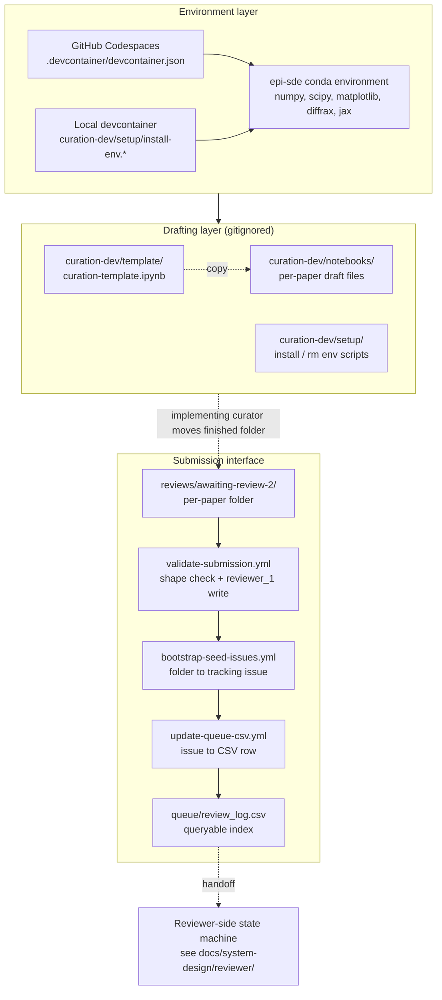

# 3 Methodology

The curator side uses hierarchical task analysis to decompose the curation pair's procedure, a simple state model for the working artifact (draft in `curation-dev/`, submitted to `reviews/awaiting-review-2/`), a sequence diagram for the PR submission flow, and a layered architecture that separates the curation pair's working environment from the submission interface.

---

## 3.1 Task breakdown and information flow

The curation pair's procedure has five steps, taken directly from the project orientation:

1. Choose a published model and publication figure.
2. Attempt to implement the model to reproduce the figure.
3. Document outcomes of the attempt.
4. Verify outcomes with teammate.
5. Report findings.

These map onto the work the team does locally (steps 1 through 4) and the submission that follows (step 5, realized as the PR into `reviews/awaiting-review-2/`).

### Figure 1: Curation pair hierarchical task analysis

```mermaid
flowchart TD
    G[Goal: curate a verified epidemiological SDE model<br/>and report findings]
    G --> T1[Task 1<br/>Choose a model and figure]
    G --> T2[Task 2<br/>Attempt to implement]
    G --> T3[Task 3<br/>Document outcomes]
    G --> T4[Task 4<br/>Verify outcomes with teammate<br/>(first review)]
    G --> T5[Task 5<br/>Report findings<br/>(submit for second review)]

    T1 --> T1a[1a. Find a candidate paper:<br/>DOI or comparable + infection dynamics]
    T1 --> T1b[1b. Identify the figure to reproduce]
    T1 --> T1c[1c. Decide which teammate implements]

    T2 --> T2a[2a. Open the working environment<br/>(Codespace or local devcontainer)]
    T2 --> T2b[2b. Copy curation-template.ipynb<br/>into curation-dev/notebooks/<paper-id>.ipynb]
    T2 --> T2c[2c. Fill metadata header<br/>(Curator, Title, Pathogen, DOI, Figure)]
    T2 --> T2d[2d. Implement drift_term and diffusion_term<br/>from paper equations]
    T2 --> T2e[2e. Fill parameter values with #SOURCE: annotations]
    T2 --> T2f[2f. Run notebook end to end;<br/>compare figure to paper]

    T3 --> T3a[3a. Set Outcome (Successful or Failed)]
    T3 --> T3b[3b. Fill Notes with anything off-paper:<br/>assumptions, missing equations, missing parameters,<br/>missing initial conditions]
    T3 --> T3c[3c. NO guessing or approximating:<br/>document absences, do not invent values]

    T4 --> T4a[4a. Teammate opens the same notebook]
    T4 --> T4b[4b. Teammate re-runs from a clean kernel]
    T4 --> T4c[4c. Teammate cross-checks parameters,<br/>equations, and initial conditions against paper]
    T4 --> T4d[4d. Teammate confirms or pushes back<br/>on the documented Outcome and Notes]

    T5 --> T5a[5a. Implementing curator creates<br/>reviews/awaiting-review-2/<paper-id>/]
    T5 --> T5b[5b. Add notebook, manuscript PDF,<br/>optional output image, optional metadata.yml]
    T5 --> T5c[5c. Commit, push branch, open PR]
    T5 --> T5d[5d. validate-submission.yml runs:<br/>shape check, reviewer_1 written]
    T5 --> T5e[5e. Merge PR after green check]
    T5 --> T5f[5f. bootstrap-seed-issues.yml creates [REVIEW] issue;<br/>update-queue-csv.yml appends to review_log.csv]
```

### 3.1.1 Task 1: Choose a model and figure

The pair selects a candidate paper that meets two criteria: published with a DOI or comparable identifier, and describing infection dynamics at any pathogen scale or biological scale. Within the paper, the pair identifies the specific figure to reproduce, and the pair decides which teammate will be the implementing curator (and therefore the PR author and `reviewer_1`).

**Table VII: Task 1 information flow, system feedback, completion cue**

| Step | Information flow | System feedback | Completion cue |
|---|---|---|---|
| Find a candidate paper | The pair reads candidate papers and applies selection criteria | None automated | Pair agrees on a paper |
| Identify the figure | The pair reads the paper to identify a specific figure as the reproduction target | None automated | Pair agrees on a figure |
| Decide who implements | The pair agrees on which teammate is the implementing curator | None automated | Implementing teammate identified |

### 3.1.2 Task 2: Attempt to implement

The implementing curator opens the environment, copies the template, fills the metadata header, implements the paper's equations as `drift_term` and `diffusion_term` functions, supplies parameter values with `#SOURCE:` annotations, and runs the notebook end to end. The reproducibility-testing criteria the implementing curator checks during this task: are the equations used to produce the figure described? Are all model parameters available? Are all initial conditions available?

**Table VIII: Task 2 information flow, system feedback, completion cue**

| Step | Information flow | System feedback | Completion cue |
|---|---|---|---|
| Open the environment | Codespace from `.devcontainer/`, or local conda from `curation-dev/setup/install-env.*` | Environment activates; notebook server starts | Imports succeed |
| Copy template | Implementing curator copies `curation-dev/template/curation-template.ipynb` to `curation-dev/notebooks/<paper-id>.ipynb` | New notebook visible | Notebook ready |
| Fill metadata header | Curator fills Curator, Title, Pathogen, DOI, Figure | None automated | Header complete |
| Implement drift and diffusion | Curator translates equations into `drift_term(t, y, p)` and `diffusion_term(t, y, p)` | None until run | Code compiles |
| Supply parameter values | Curator fills `parameter_values`, `initial_values`, `initial_time`, `final_time` with `#SOURCE:` comments | None automated | Each value cited |
| Run end to end | Curator clicks Run All | Cell outputs appear; final cell produces a figure | Curator compares to paper figure |

### 3.1.3 Task 3: Document outcomes

The implementing curator records what happened. Outcome is `Successful` if the produced figure looks like the published figure, `Failed` otherwise. Notes records anything off-paper: assumptions the curator had to make, equations or parameters or initial conditions that were missing from the publication. The rule for this stage is no guessing or approximating. If something is missing from the paper, the curator documents the absence; they do not invent a substitute.

**Table IX: Task 3 information flow, system feedback, completion cue**

| Step | Information flow | System feedback | Completion cue |
|---|---|---|---|
| Set Outcome | Curator updates the Outcome field to `Successful` or `Failed` | None automated | Outcome reflects reality |
| Fill Notes | Curator records assumptions, missing items, anything deviating from the paper | None automated | Notes are complete |
| Confirm no inventions | Curator reviews the notebook for any guessed or approximated values | None automated | Every value is sourced or documented as absent |

### 3.1.4 Task 4: Verify outcomes with teammate (first review)

The verifying teammate opens the notebook, re-runs it from a clean kernel, cross-checks the parameters and equations against the paper, and confirms or pushes back on the documented Outcome and Notes. The first review is informal; the system does not gate on it. The verifying teammate's confirmation is communicated within the team.

**Table X: Task 4 information flow, system feedback, completion cue**

| Step | Information flow | System feedback | Completion cue |
|---|---|---|---|
| Open the notebook | The verifying teammate opens the implementing curator's `<paper-id>.ipynb` | Notebook appears in the editor | Teammate ready |
| Re-run from clean kernel | Teammate restarts the kernel and runs all cells | Cells execute; outputs match (or do not match) the implementing curator's outputs | Teammate compares to documented Outcome |
| Cross-check against paper | Teammate verifies parameters, equations, and initial conditions cell by cell | None automated | Teammate satisfied or pushes back |
| Confirm or push back | Teammate agrees with the documented Outcome and Notes, or names what they disagree with | Direct conversation within the team | Pair agrees on the final Outcome and Notes |

### 3.1.5 Task 5: Report findings (submit for second review)

The implementing curator moves the finished folder out of `curation-dev/` and into `reviews/awaiting-review-2/`, opens a PR, and lets the submission workflows run.

**Table XI: Task 5 information flow, system feedback, completion cue**

| Step | Information flow | System feedback | Completion cue |
|---|---|---|---|
| Create submission folder | Implementing curator creates `reviews/awaiting-review-2/<paper-id>/` and copies the notebook into it | New folder visible | Folder exists |
| Add manuscript PDF | Curator places the paper's PDF in the folder | File visible | PDF is in the folder |
| Add output image (optional) | Curator places a representative figure as `.png` or `.svg` | File visible | Image is in the folder |
| Add `metadata.yml` (optional) | Curator can pre-populate `metadata.yml` with `doi:` | File visible | Metadata is in the folder |
| Commit and push branch | Curator commits files to a feature branch and pushes | Push completes | Branch is on GitHub |
| Open pull request | Curator opens PR against `main` | PR appears on GitHub | PR is open |
| `validate-submission.yml` runs | Workflow checks folder shape, warns on missing image, writes `reviewer_1` to `metadata.yml` on same-repo PR | Check status appears on PR; comment posted if shape is wrong | Green check |
| Merge PR | Curator merges via the GitHub UI | Branch merged into main | PR closes |
| Issue is created | `bootstrap-seed-issues.yml` creates `[REVIEW]` issue with `awaiting-review-2` label | Issue appears in Issues tab | Tracking issue exists |
| CSV updated | `update-queue-csv.yml` appends a row to `queue/review_log.csv` | Bot commit on main | CSV row exists |

---

## 3.2 Working artifact state

The curation stage produces an artifact that exists in one of two locations during its lifecycle. While in draft, the notebook lives under `curation-dev/notebooks/` and is gitignored. Once the pair agrees the work is ready (Task 4 complete), the implementing curator moves the finished folder to `reviews/awaiting-review-2/<paper-id>/` and opens a PR. From that point on, the artifact is governed by the reviewer-side state machine.

### Figure 2: Curation artifact state

```mermaid
stateDiagram-v2
    [*] --> draft_in_curation_dev : implementing curator copies template
    draft_in_curation_dev --> draft_in_curation_dev : Task 2 + Task 3<br/>(implement, run, document)
    draft_in_curation_dev --> awaiting_teammate_verification : implementing curator considers<br/>Outcome documented
    awaiting_teammate_verification --> draft_in_curation_dev : teammate pushes back
    awaiting_teammate_verification --> submitted_in_PR : teammate confirms;<br/>implementing curator opens PR
    submitted_in_PR --> awaiting_review_2 : PR merged;<br/>reviewer-side state machine begins
    awaiting_review_2 --> [*] : (see reviewer state machine)
```

---

## 3.3 Submission sequence model

The submission flow involves the implementing curator, the PR, three workflows (`validate-submission.yml`, `bootstrap-seed-issues.yml`, `update-queue-csv.yml`), the git filesystem, and the issue tracker.

### Figure 3: Submission sequence

```mermaid
sequenceDiagram
    actor C as Implementing curator
    participant PR as Pull Request
    participant VS as validate-submission.yml
    participant Git as Git / Filesystem
    participant Main as main branch
    participant BS as bootstrap-seed-issues.yml
    participant Issue as GitHub Issue
    participant UQ as update-queue-csv.yml
    participant CSV as queue/review_log.csv

    C->>PR: open PR with folder under<br/>reviews/awaiting-review-2/
    PR->>VS: pull_request event
    VS->>Git: git diff to find touched folders
    VS->>VS: check folder shape (.ipynb + .pdf required)
    alt shape valid
        VS->>Git: write reviewer_1: <PR author> to metadata.yml<br/>(same-repo PR only)
        VS->>Git: commit + push to PR branch
        VS->>PR: check passes
    else shape invalid
        VS->>PR: post failure comment; check fails
    end
    C->>PR: merge after green check
    PR->>Main: branch merged
    Main->>BS: push event with reviews/awaiting-review-2/** path filter
    BS->>BS: list folders without existing issue
    BS->>Git: read metadata.yml for doi and reviewer_1
    BS->>Issue: create [REVIEW] issue with awaiting-review-2 label
    Issue->>UQ: issues.opened event
    UQ->>UQ: parse name and doi from title and body
    UQ->>CSV: append row name,doi,added_by,added_on,issue_number
    UQ->>Git: commit + push to main
```

---

## 3.4 Layered architecture

The curator side separates into three layers. The environment layer provides the curation pair's working space (Codespace or local devcontainer) plus the `epi-sde` Python environment. The drafting layer is the gitignored `curation-dev/` workspace with template, notebooks, and setup scripts. The submission interface is the PR-based handoff into `reviews/awaiting-review-2/`, which triggers three workflows that record authorship, create the tracking issue, and update the queue index. The reviewer-side state machine takes over from there.

### Figure 4: Curator-side layered architecture



---

## 3.5 Tools used in curation

### Table XII: Tools used in curation

| Tool | Purpose | Layer it serves |
|---|---|---|
| GitHub Codespaces | Browser-based development environment with the `epi-sde` env pre-built | Environment |
| Local devcontainer config (`.devcontainer/`) | Defines the same environment for Codespaces | Environment |
| Local conda via `curation-dev/setup/install-env.*` | Local alternative; builds the same `epi-sde` env on the curator's machine | Environment |
| `epi-sde` conda environment | Python 3 plus `numpy`, `scipy`, `matplotlib`, `pandas`, `tqdm`, `notebook`, `ipywidgets`, `ipyevents`, `diffrax`, `jax` | Environment |
| Miniconda (recommended) | Conda installer for the local path | Environment |
| VS Code | Editor for both Codespace and local paths | Environment |
| `curation-dev/template/curation-template.ipynb` | Blank notebook with metadata header and named code cells for SDE model implementation | Drafting |
| `curation-dev/notebooks/curation-example.ipynb` | Worked example for new curators | Drafting |
| Jupyter (notebook + ipywidgets) | The interactive runtime for building and testing the reproduction | Drafting |
| `diffrax` and `jax` | SDE solver and JIT compilation for stochastic differential equation models | Drafting |
| Pull requests | Submission gate. Triggers `validate-submission.yml` | Submission |
| `validate-submission.yml` | Folder-shape check; records `reviewer_1` automatically on same-repo PR | Submission |
| `bootstrap-seed-issues.yml` | Creates the `[REVIEW]` tracking issue when a folder appears under `reviews/awaiting-review-2/` | Submission |
| `update-queue-csv.yml` | Appends the issue to `queue/review_log.csv` for downstream discoverability | Submission |
