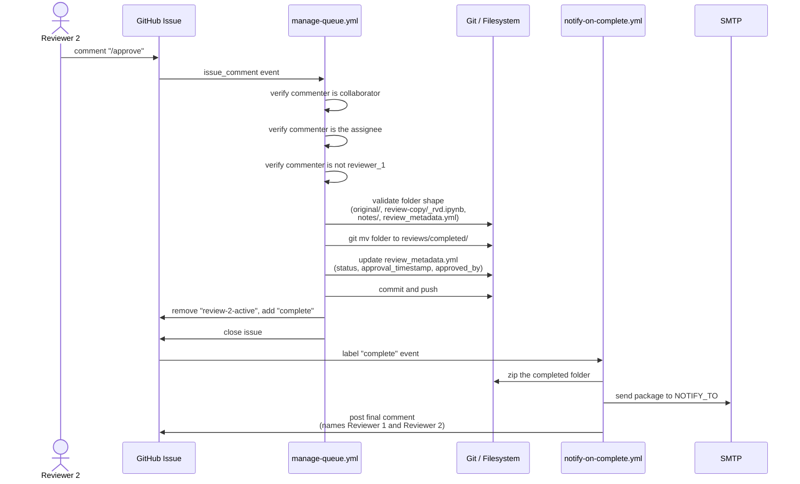
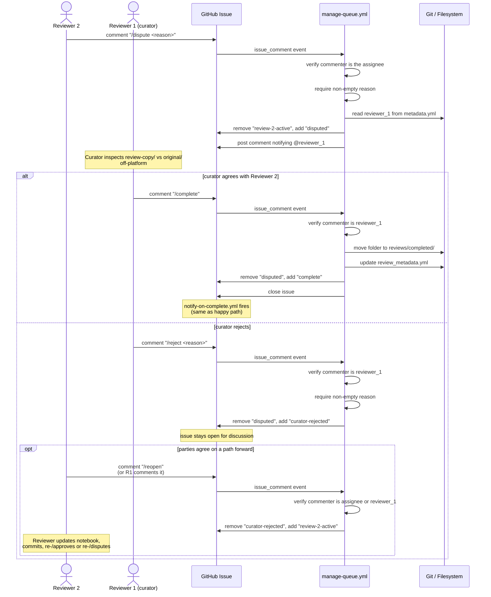
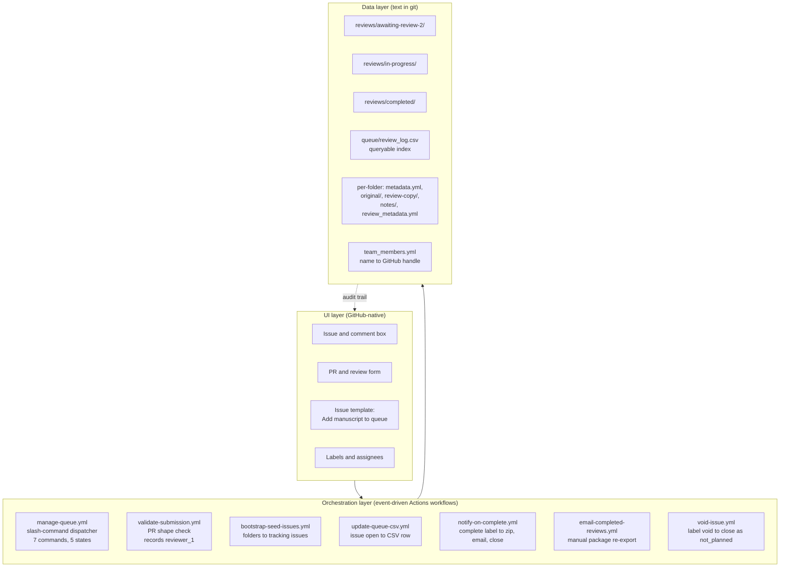

# Methodology

## What the steps are

Reviewer 2's job is to produce a verified review record for one paper. Three primary tasks reach the goal: claim work, perform the review and decide, and participate in dispute resolution when one is raised. The curator's submission task and the curator's resolution actions are documented separately in the curator-side system design.

### Reviewer 2 hierarchical task analysis

```mermaid
flowchart TD
    G[Goal: produce a verified, traceable<br/>verified review record for one paper]
    G --> T1[Task 1<br/>Claim work]
    G --> T2[Task 2<br/>Perform review and decide]
    G --> T3[Task 3<br/>Participate in dispute resolution]

    T1 --> T1a[1a. Browse awaiting-review-2 issues]
    T1 --> T1b[1b. Verify not Reviewer 1 for this item]
    T1 --> T1c[1c. Comment /checkout]
    T1 --> T1d[1d. System assigns, moves folder, creates structure]

    T2 --> T2a[2a. Pull files locally]
    T2 --> T2b[2b. Open review-copy/_rvd.ipynb, re-run cells]
    T2 --> T2c[2c. Annotate #CHANGED and optionally #SOURCE]
    T2 --> T2d[2d. Fill notes/review_notes.md]
    T2 --> T2e[2e. Commit and push]
    T2 --> T2f[2f. Comment /approve, /dispute reason, or /release]

    T3 --> T3a[3a. Wait for curator response after /dispute]
    T3 --> T3b[3b. If /complete: nothing further required]
    T3 --> T3c[3c. If /reject: discuss with curator in issue comments]
    T3 --> T3d[3d. If path agreed: /reopen to return to active review]
    T3 --> T3e[3e. Update notebook, push, re-/approve or re-/dispute]
```

### Task 1: Claim work

The reviewer browses the queue, confirms eligibility, and claims an item with one comment. The system handles assignment, folder movement, and review-structure creation as a single transaction.

**Steps in detail:**

| Step | What happens | What you see | How you know it's done |
|---|---|---|---|
| Browse open issues | GitHub UI presents `awaiting-review-2` labeled items | Issue list filtered by label | Reviewer reads issue body for paper info |
| Verify eligibility | Issue body shows recorded `reviewer_1` | None automated; manual check | Reviewer confirms they are not Reviewer 1 |
| Comment `/checkout` | Comment posted to the issue | `manage-queue.yml` fires | Reviewer waits for workflow |
| Workflow processes the claim | Workflow reads issue body for `<!-- folder: ... -->` marker, reads `metadata.yml.reviewer_1`, runs collaborator check and reviewer-exclusion check | Confirmation comment with @-mention; bot commit appears on `main` | Reviewer sees confirmation |
| Folder moves and structure is created | Workflow does `git mv` from `awaiting-review-2` to `in-progress`; creates `original/`, `review-copy/`, `notes/`, `review_metadata.yml` | Bot commits and pushes the moves and structure | Reviewer pulls locally |
| Label transitions | Workflow swaps `awaiting-review-2` for `review-2-active`; adds the reviewer as assignee | Label change visible on issue | Reviewer sees state change |

### Task 2: Perform the review and decide

The reviewer re-runs the notebook locally, annotates any changes, writes notes, commits, and decides between three commands: `/approve`, `/dispute <reason>`, or `/release`. The decision command triggers the final state transition.

**Steps in detail:**

| Step | What happens | What you see | How you know it's done |
|---|---|---|---|
| Pull files | Local git fetches latest from `origin/main` | New folder structure appears locally | Reviewer opens `review-copy/_rvd.ipynb` |
| Re-run notebook | Reviewer executes cells; outputs generated locally | Cell outputs in the notebook | Reviewer compares to manuscript PDF |
| Annotate changes | Reviewer adds `#CHANGED: reason` and optionally `#SOURCE:` inline | None automated; local edits | Reviewer satisfied with annotations |
| Fill notes | Reviewer writes content in at least one section of `notes/review_notes.md` | None automated; local edits | Reviewer has a written summary |
| Commit and push | Reviewer pushes to `origin/main` | Git records the commit | Push completes |
| Comment `/approve` | Reviewer posts approval | Workflow runs collaborator check, assignee check, reviewer-exclusion check, folder-shape validation; moves folder to `completed/`; updates `review_metadata.yml`; applies `complete`; closes the issue | `notify-on-complete.yml` zips and emails the folder; final summary comment appears |
| Or comment `/dispute <reason>` | Reviewer posts dispute with reason | Workflow applies `disputed`, posts @-mention to recorded curator | Reviewer waits for curator (see Task 3) |
| Or comment `/release` | Reviewer hands back | Workflow unassigns reviewer, moves folder back to `awaiting-review-2/`, applies `awaiting-review-2` | Issue returns to queue |

### Task 3: Participate in dispute resolution

This task runs only when Reviewer 2 raised `/dispute`. The reviewer waits passively for the curator's response, then either nothing further is required (if the curator `/complete`d) or the parties iterate via issue comments and `/reopen` until an agreed path forward exists.

**Steps in detail:**

| Step | What happens | What you see | How you know it's done |
|---|---|---|---|
| Wait for curator | Reviewer monitors GitHub notifications | None | Curator posts `/complete` or `/reject` |
| If `/complete`: issue closes, files move to `completed/` | Workflow runs the same path as `/approve` | `notify-on-complete.yml` fires | Reviewer sees closure comment |
| If `/reject <reason>`: label changes to `curator-rejected`, issue stays open | Curator's reason posted as comment | Label visible on issue | Reviewer and curator continue in comments |
| Iterate in issue comments | Manual back-and-forth between the two parties | None automated | Parties agree on a resolution path |
| `/reopen` returns to active review | Either party comments `/reopen` | Workflow swaps `curator-rejected` for `review-2-active`; assignee unchanged | Reviewer can update the notebook and re-decide |
| Re-decide | Reviewer pushes updates and re-comments `/approve` or `/dispute` | Same flow as Task 2 finalization | Issue closes or returns to `disputed` |

---

## The state machine

The queue's lifecycle is encoded entirely in the GitHub issue's label set. The label is the single source of truth for where a paper is in the process. Folder location and metadata follow the label, not the other way around. Every state transition is driven by a slash command, every command goes through `manage-queue.yml`, and every command's effect is recorded in the issue timeline alongside the comment that triggered it. The audit trail is automatic because no one writes status updates; the timeline already has them.

The happy path is a three-state chain (`awaiting-review-2` → `review-2-active` → `complete`) with no curator gate. The dispute branch enters `disputed` only via `/dispute`, and only the curator can resolve it. `curator-rejected` is a non-terminal state from which `/reopen` returns the item to `review-2-active`.

### Issue label state machine

```mermaid
stateDiagram-v2
    [*] --> awaiting_review_2 : PR merged<br/>(bootstrap-seed-issues.yml<br/>creates issue)
    awaiting_review_2 --> review_2_active : /checkout<br/>(Reviewer 2; not Reviewer 1)
    review_2_active --> awaiting_review_2 : /release<br/>(Reviewer 2 abandons)
    review_2_active --> complete : /approve<br/>(Reviewer 2; integrity check)
    review_2_active --> disputed : /dispute reason<br/>(Reviewer 2 escalates)
    disputed --> complete : /complete<br/>(curator accepts)
    disputed --> curator_rejected : /reject reason<br/>(curator rejects)
    curator_rejected --> review_2_active : /reopen<br/>(reviewer or curator)
    complete --> [*] : notify-on-complete.yml<br/>zips, emails, closes issue
```

---

## Sequence diagrams

Five actors participate in a review: Reviewer 1 (the curator), Reviewer 2, the GitHub issue (as the durable record), the Actions runner (as the orchestrator), and the git filesystem (as the data store). The sequence diagrams below trace the two consequential interactions: the happy path (`/approve`) and the dispute branch (`/dispute` followed by `/complete`, `/reject`, or `/reopen`).

### Happy path, `/approve` direct to complete

### Dispute branch, `/dispute` followed by curator action and optional `/reopen`

---

## Layered architecture

The system separates into three layers, each replaceable without touching the layers above or below. The UI layer is GitHub's native issue interface and comment box: what reviewers touch. The orchestration layer is seven Actions workflows that respond to events (PR open, push to main, issue comment, label change, issue open). The data layer is the filesystem queue under `reviews/`, the index `queue/review_log.csv`, and per-folder metadata files. There is no separate logic layer in the currently active code path: business rules live inside the orchestration workflows themselves. One Python helper, the cell-by-cell notebook diff generator, lives in `scripts/archive/` and is no longer invoked.

### Operating-state layered architecture

---

## Tools

### Tools

| Tool | What it does | Where it fits |
|---|---|---|
| GitHub Actions | Event-driven orchestration for slash commands, PR validation, issue seeding, completion notifications | Orchestration |
| GitHub Issues | Tracking record for each paper. Labels carry state. Comments carry commands and explanations | UI and audit trail |
| GitHub Pull Requests | Submission gate. Runs `validate-submission.yml`. Records `reviewer_1` automatically | UI (submission side) |
| `actions/github-script@v7` | Inline JavaScript inside workflows for issue, label, and comment operations | Orchestration |
| Node.js `fs` and `path` | Filesystem operations on the review folder structure inside workflows | Orchestration |
| `child_process.execFileSync` with `git` | Bot-driven `git mv`, commit, and push from within workflows | Orchestration |
| `dawidd6/action-send-mail@v3` | SMTP send for completed-review email packages | Orchestration |
| Python 3.11 with `pyyaml` | Helper script `scripts/archive/generate_diff_report.py`, currently dormant | Logic (archived) |
| Mermaid (in markdown) | State machine, sequence, and layered architecture diagrams in documentation | Documentation |
| Jupyter notebooks (`.ipynb`) | The reviewable artifact. Contains the reproduction model and reviewer annotations | Data |
